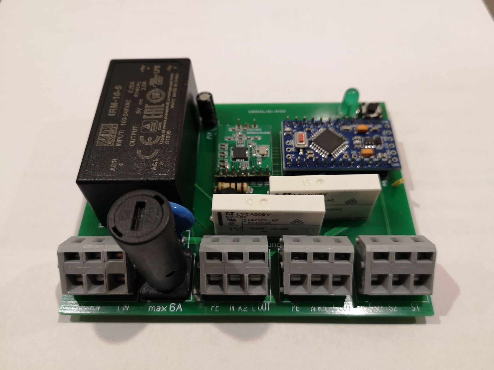
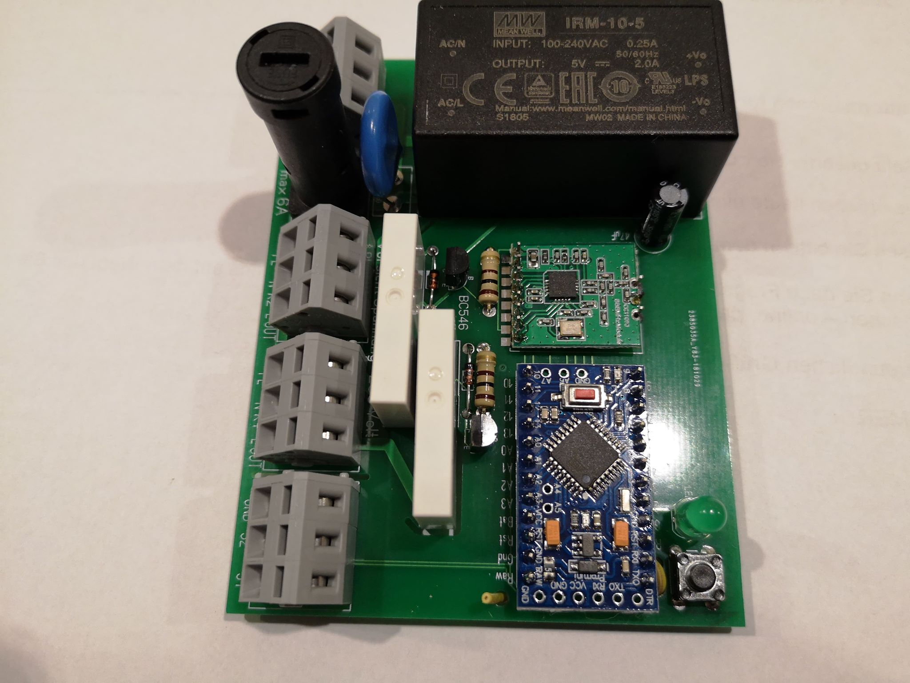
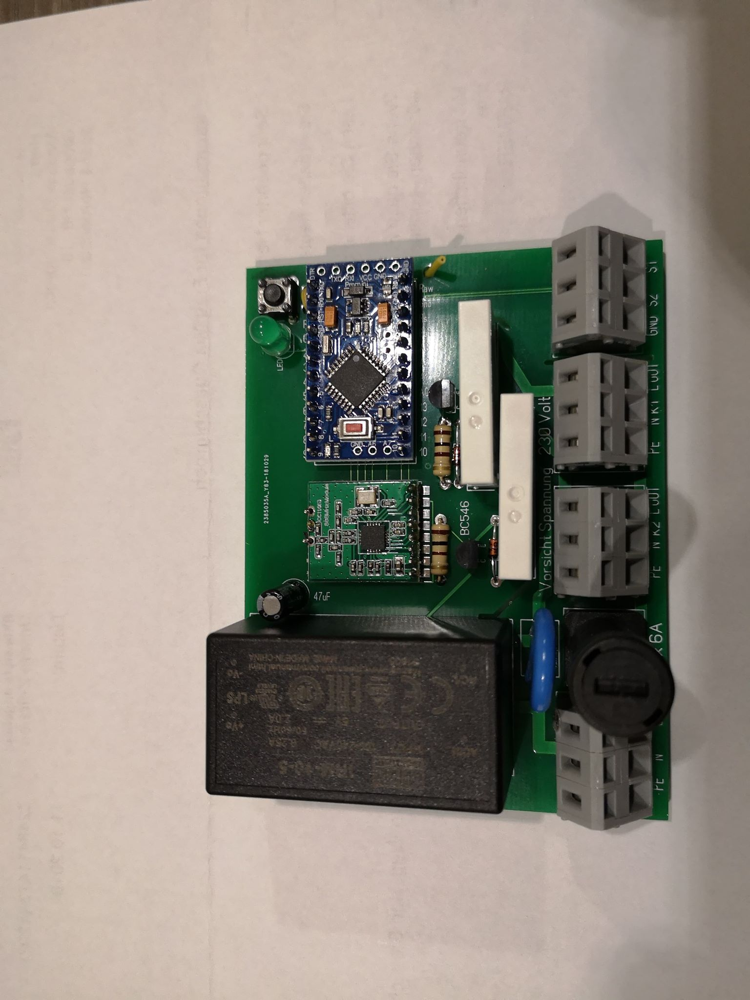
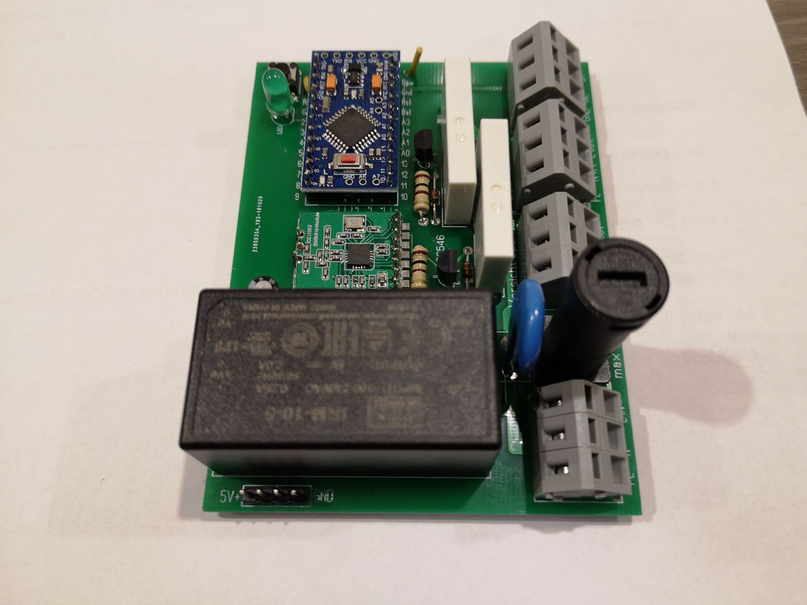
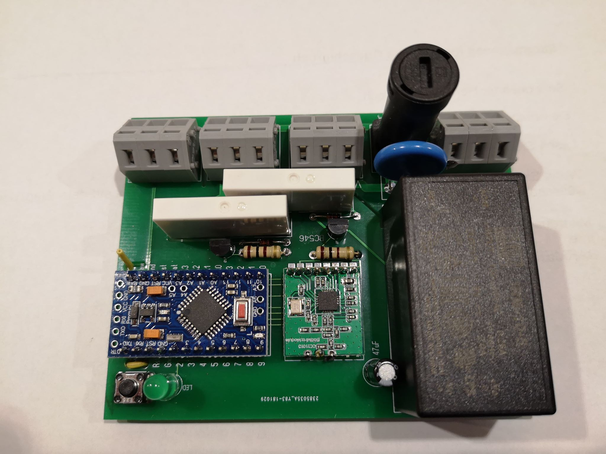
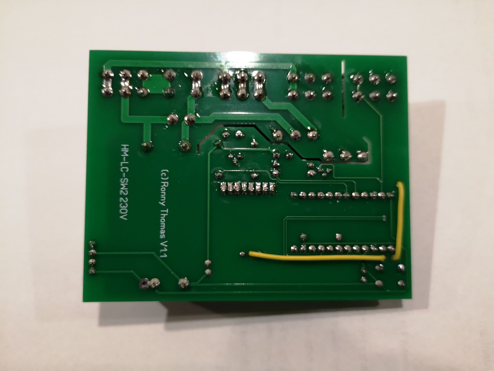

# HM-LC-Sw2-230V
# 2x 6A 230V Schaltkontakt mit 2 Schalteingängen; 

## benötigte Hardware
* 1x Arduino Pro Mini **ATmega328P (3.3V/8MHz)**
* 1x CC1101 Funkmodul **(868 MHz)**
* 1x FTDI Adapter (wird nur zum Flashen benötigt)
* 4x WAGO 236-403
* 2x Relais FTRLYCA 005V
* 2x BC546
* 3x 1/4W 330 Ohm Widerstand
* 1x Led 5mm
* 1x Taster 6x6
* 2x Diode 1N4148
* 1x Netzetil Meanwell IRM-05-5
* 1x Sicherung 5x20 6A
* 1x Sicherungshalter PL FPG4-40
* 1x VDR-0,6 250

[Kontakt via Facebook](https://www.facebook.com/ronny.thomas.83)

[Software je nach Projekt](https://github.com/jp112sdl/Beispiel_AskSinPP/blob/master/examples/HM-LC-Sw2-FM/HM-LC-Sw2-FM.ino) von Jérôme

[Case](https://www.thingiverse.com/thing:4567223)

Bilder vom Mathias Q.

